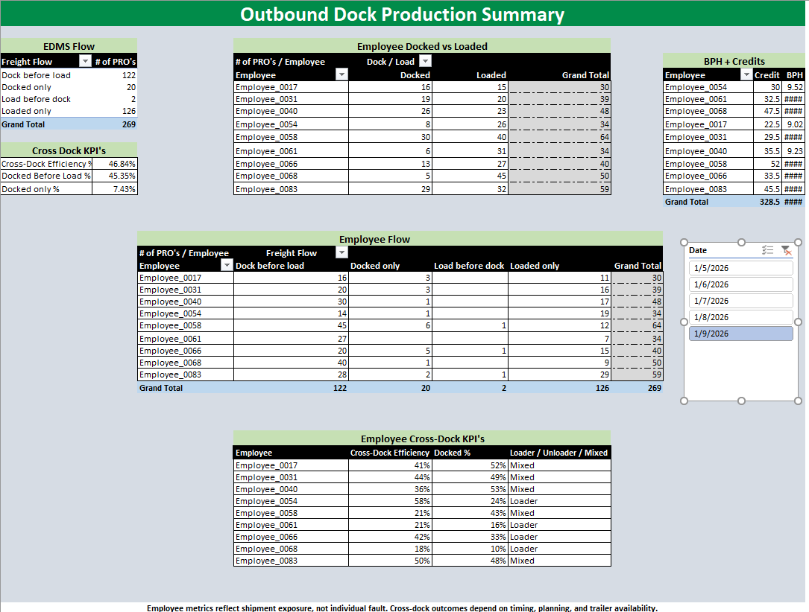
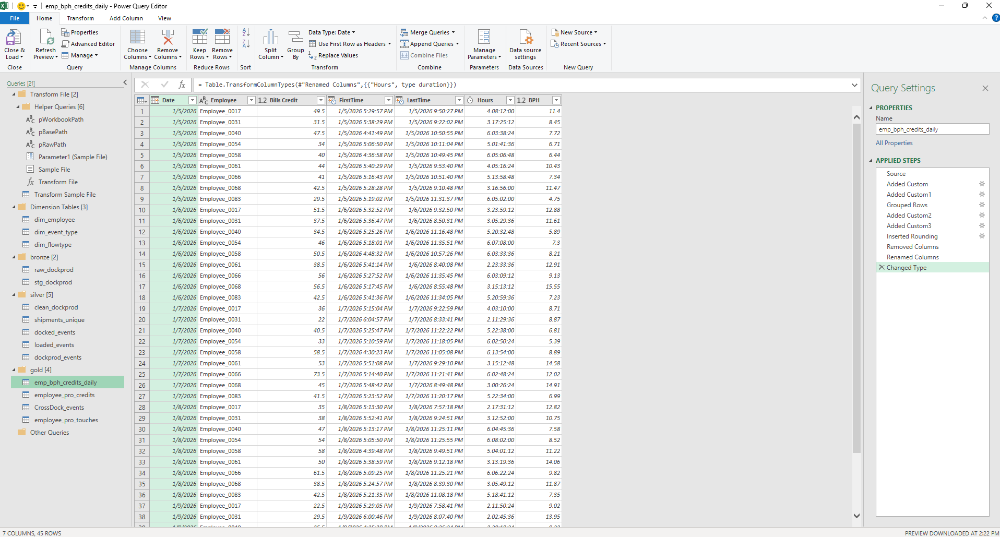

# Dock Productivity ETL (Excel / Power Query)

**TL;DR**  
A production-style Excel Power Query ETL pipeline that transforms messy, human-formatted dock activity exports into reliable productivity, cross-docking efficiency, and credit-based BPH metrics.

---

## Overview
This project demonstrates a full **Bronze → Silver → Gold ETL pipeline** built entirely in **Excel Power Query**.

The source files were originally designed for visual reporting, not automation, requiring careful normalization to prevent silent data loss and ensure accurate analysis.

All sensitive identifiers have been anonymized while preserving relational integrity.

---

## Business Questions Answered
- How many **unique shipments (PROs)** were handled per day?
- How efficiently were shipments **cross-docked**?
- How do **loader behaviors** differ by employee?
- How does **credit-based BPH** compare across workers and dates?

---

## ETL Design

The pipeline follows a layered architecture:

### Bronze
- Ingest XLSX files from folder
- Normalize Excel used-range issues
- Remove non-data rows
- Promote headers

### Silver
- Enforce data types
- Normalize shipment identifiers
- Derive canonical activity dates
- Anonymize sensitive fields
- Deduplicate and classify events

### Gold
- Aggregate shipment credits
- Calculate Bills Handled and BPH
- Classify cross-dock flow behavior
- Produce model-ready fact tables

---

## Data Model
- Star-schema style Excel Data Model
- Dimensions: Date, Employee, FlowType
- Facts: Shipment touches, daily employee productivity
- Used for OLAP PivotTables and KPI calculations

---

## Key Metrics
- **Bills Handled (Credits)**
- **Bills Per Hour (BPH)**
- **Cross-Dock Efficiency**
- **Dock vs Load Flow Distribution**

---

## Portability & Configuration
All file paths are **dynamically resolved** based on the workbook location.  
The project can be run from any directory as long as the folder structure is preserved.

---

## Files
- `etl/DockProd_ETL.xlsx` – Live ETL pipeline and interactive summary
- `report/DockProd_Snapshot.xlsx` – Static, executive-safe snapshot
- `data/raw_samples_sanitized/` – Sanitized sample source files

---

## Tools Used
- Microsoft Excel
- Power Query (M)
- Excel Data Model (Power Pivot)
- PivotTables & slicers

---

## Key Takeaways
- Human-formatted Excel exports require additional normalization for automation.
- Excel used-range metadata can silently truncate ingested data.
- Separating shipment counts from labor credits is critical for accurate productivity metrics.
- Excel Power Query can support production-grade ETL when designed intentionally.
